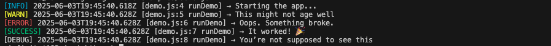
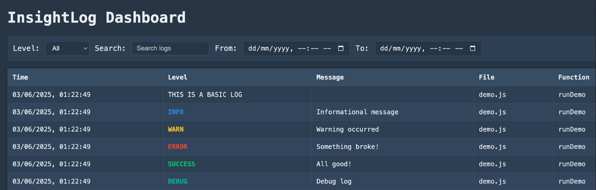

# 🔍 insightLog

> A logging library with more brains than brawn.

`insightLog` is like your favorite debugging sidekick — it knows *where*, *when*, and *why* something logged… and it doesn’t scream at you in monochrome.

---

## 😎 Why insightLog?

- Because `console.log("here?")` is 2023's energy, and you deserve better.
- Looks Cool. Not just looks , it's really cool :)

Here’s what you get with **zero setup**:

- 📍 **File, Function, Line Number** — automatic, no config, no cookies , no biscuits.
- 💄 **Styled Logs** — pretty colors in Node, custom `%c` styling in the browser.
- 🧠 **Smart Filtering** — built-in local dashboard with search, filters, and dark mode, obviously.
- 📦 **Works Anywhere** — Node, React, Vite, underwater JavaScript*.

> \* okay maybe not underwater JavaScript. But everything else.

---

## 📦 Installation

```bash
npm install insightlog
```

Browser-based apps? You’re good too:

```javascript
import { log } from "insightlog";
```


## 🔥 Quick Demo

```javascript
const { log } = require("insightlog");

log.info("Starting the app...");
log.warn("This might not age well");
log.error("Oops. Something broke.");
log.success("It worked! 🎉");
log.debug("You’re not supposed to see this");
```



Browser logs are color-coded. Node logs are CLI-hackers.

## 🖥️ Your Personal Logging Dashboard
We ship with a full dark-themed local dashboard — because scrolling through terminal logs is so 2009.

🏁 Start It Like This:

```bash
npx insightlog-dashboard
```

Runs on http://localhost:1337

and use the imports mention like these 

```javascript
import { log } from "insightlog";
```

HERE we goooooo !!! 




- Reads from local logs (Node logs)
- Streams browser logs to server in real-time
- Filter by level, component, function, and keywords
- Built-in search. Because grep is great but this is better.

That’s a real log. With brains. Not a raw console.log.

# 🧑‍💻 Author

Brought to you by [cinfinite](https://github.com/cinfinit), who once logged `"why?"` and got `"undefined"` back. So this happened.

After years of wrestling with colorless logs, mysterious stack traces, and the eternal question of *"which file even called this?"*, they decided it was time to stop the madness. Thus, `insightLog` was born — part therapy project,  part quality-of-life upgrade , and entirely too much fun to stop building.

Sleep was optional. Clean logs weren't.

---
